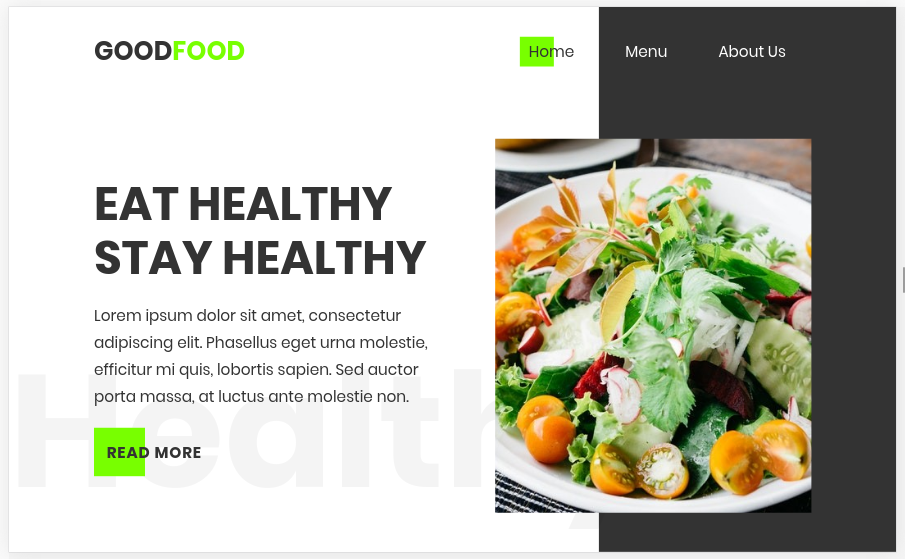

<!--
*** Thanks for checking out this README Template. If you have a suggestion that would
*** make this better, please fork the repo and create a pull request or simply open
*** an issue with the tag "enhancement".
*** Thanks again! Now go create something AMAZING! :D
-->

<!-- PROJECT SHIELDS -->
<!--
*** I'm using markdown "reference style" links for readability.
*** Reference links are enclosed in brackets [ ] instead of parentheses ( ).
*** See the bottom of this document for the declaration of the reference variables
*** for contributors-url, forks-url, etc. This is an optional, concise syntax you may use.
*** https://www.markdownguide.org/basic-syntax/#reference-style-links
-->
[![Contributors][contributors-shield]][contributors-url]
[![Forks][forks-shield]][forks-url]
[![Stargazers][stars-shield]][stars-url]
[![Issues][issues-shield]][issues-url]


<!-- PROJECT LOGO -->
<br />
<p align="center">
  <a href="https://github.com/rammazzoti2000/restaurant_page">
    
  </a>

  <h3 align="center">JavaScript --> [Restaurant Page]</h3>

  <p align="center">
    This project is part of the Microverse curriculum in JavaScript module!
    <br />
    <a href="https://github.com/rammazzoti2000/restaurant_page"><strong>Explore the docs »</strong></a>
    <br />
    <br />
    <a href="https://github.com/rammazzoti2000/restaurant_page/issues">Report Bug</a>
    ·
    <a href="https://github.com/rammazzoti2000/restaurant_page/issues">Request Feature</a>

  </p>
</p>

<!-- TABLE OF CONTENTS -->
## Table of Contents

* [About the Project](#about-the-project)
  * [Built With](#built-with)
  * [Usage](#usage)
  * [Automated Test](#automated-test)
* [Contributors](#contributors)
* [Acknowledgements](#acknowledgements)
* [License](#license)

<!-- ABOUT THE PROJECT -->
## About The Project

This project comes after the introduction of the ES6 class keyword, ES6 modules, and WebPack. The main goal of this project is for the student to show the understanding of the benefits of modularized code as well as the ability to set up a JavaScript application made of different modules using WebPack.

;

### Built With
This project was built using these technologies.
* HTML/CSS
* JavaScript
* WebPack
* ESLint
* StyleLint
* GithubActions :muscle:
* Atom :atom:

<!-- INSTALLATION -->
## Usage

To have this app on your pc, you need to:
* [download](https://github.com/rammazzoti2000/restaurant_page/archive/develop.zip) or clone this repo:
  - Clone with SSH:
  ```
    git@github.com:rammazzoti2000/restaurant_page.git
  ```
  - Clone with HTTPS
  ```
    https://github.com/rammazzoti2000/restaurant_page.git
  ```
  ```$ cd restaurant_page
     $ npm install
  ```
  - and open `index.html` file from `/dist folder` in the browser

## Automated Test
 > No automated tests yet

## Live Demo

[Live Demo](https://raw.githack.com/rammazzoti2000/restaurant_page/feature/readme_instructions/dist/index.html) :point_left:

<!-- CONTACT -->
## Contributors

👤 **Alexandru Bangau**

- LinkedIn: [Alexandru Bangau](https://www.linkedin.com/in/alexandru-bangau/)
- GitHub: [@rammazzoti2000](https://github.com/rammazzoti2000)
- E-mail: bangau.alexandru@gmail.com

## :handshake: Contributing

Contributions, issues and feature requests are welcome!

Feel free to check the [issues page](https://github.com/rammazzoti2000/restaurant_page/issues).

## Show your support

Give a :star: if you like this project!


<!-- ACKNOWLEDGEMENTS -->
## Acknowledgements
* [Microverse](https://www.microverse.org/)
* [The Odin Project](https://www.theodinproject.com/)

<!-- MARKDOWN LINKS & IMAGES -->
<!-- https://www.markdownguide.org/basic-syntax/#reference-style-links -->
[contributors-shield]: https://img.shields.io/github/contributors/rammazzoti2000/restaurant_page.svg?style=flat-square
[contributors-url]: https://github.com/rammazzoti2000/restaurant_page/graphs/contributors
[forks-shield]: https://img.shields.io/github/forks/rammazzoti2000/restaurant_page.svg?style=flat-square
[forks-url]: https://github.com/rammazzoti2000/restaurant_page/network/members
[stars-shield]: https://img.shields.io/github/stars/rammazzoti2000/restaurant_page.svg?style=flat-square
[stars-url]: https://github.com/rammazzoti2000/restaurant_page/stargazers
[issues-shield]: https://img.shields.io/github/issues/rammazzoti2000/restaurant_page.svg?style=flat-square
[issues-url]: https://github.com/rammazzoti2000/restaurant_page/issues

## 📝 License

This project is [MIT](https://opensource.org/licenses/MIT) licensed.
